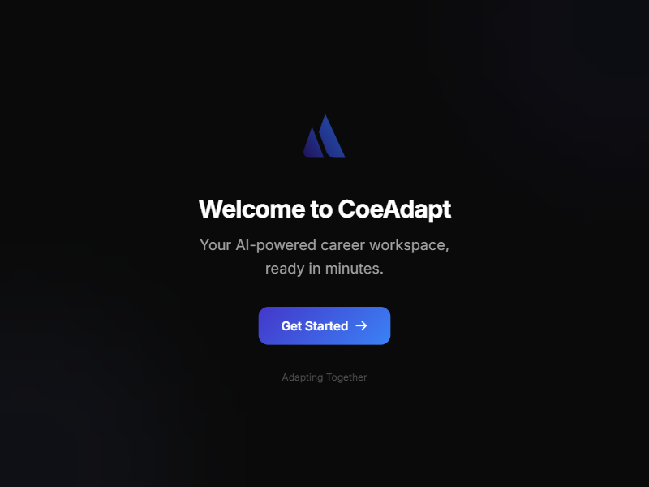
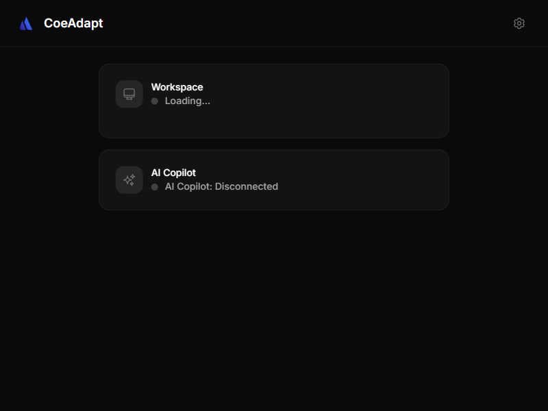
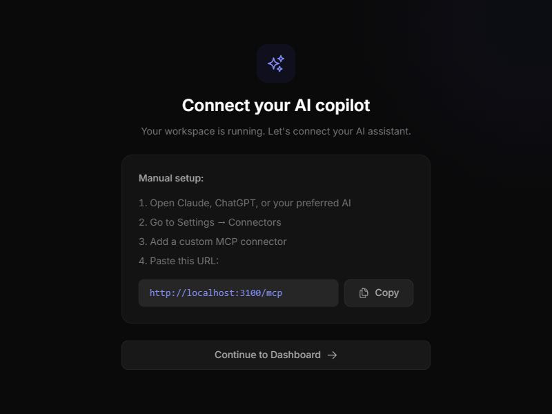

# Career-Box

**A containerized career workspace powered by AI.**

Career-Box gives you a full Linux desktop pre-loaded with career development tools — browsers, IDEs, office suites, security tools, and more — all running in a Docker container on your machine. A desktop launcher manages everything so you never touch a terminal. An MCP server connects the workspace to AI so your career coach can see your screen, run commands, open applications, and help you do real work.

No Docker knowledge. No Linux experience. Just launch and go.

<p align="center">
  
  
</p>

---

## What is Career-Box?

Career-Box is the hands-on workspace component of the [Coeadapt](https://coeadapt.com) career development platform. Think of it as your personal career lab.

It brings together two powerful open-source projects:

- **[Kasm Workspaces](https://github.com/kasmtech/workspaces-images)** — a container streaming platform that delivers full Linux desktops and applications through your browser. Kasm provides the isolated, reproducible environment where career work happens.
- **[OpenClaw](https://github.com/openclaw/openclaw)** — an AI agent framework with built-in tools for shell execution, web search, browser automation, file management, and persistent memory. OpenClaw provides the intelligence layer that turns the workspace into an AI-powered career assistant.

**Why combine them?** Career development requires both *doing* and *thinking*. Kasm gives you a safe, disposable desktop where you can practice coding, build portfolios, and run tools without messing up your main machine. OpenClaw gives an AI assistant the ability to see your workspace, run commands, open applications, and interact with the tools inside it. Together, they create a career workspace where AI doesn't just advise — it *works alongside you*.

**Cora** — the AI career companion at [coeadapt.com](https://coeadapt.com) — is the coaching brain built on top of this foundation. She uses OpenClaw's tools to guide assessments, suggest learning paths, review resumes, and build portfolios. **Career-Box** is where you *do the work*: practice new skills, build your portfolio, prep for interviews, and manage job applications — all inside a secure, isolated desktop that Cora can see and interact with.

### How it works

```
┌────────────────────────────────────────────────────────────┐
│  Cora (coeadapt.com/cora)                                  │
│  AI career companion — powered by OpenClaw agent framework │
└────────────────────┬───────────────────────────────────────┘
                     │  Cloud API
                     │
        ┌────────────▼───────────────────────────────┐
        │  Your Machine                              │
        │                                            │
        │  ┌──────────────────────────────────────┐  │
        │  │  Coeadapt Launcher (system tray)     │  │
        │  │  Manages container + MCP server      │  │
        │  └──────┬──────────────┬────────────────┘  │
        │         │              │                   │
        │    ┌────▼────┐   ┌────▼───────────┐       │
        │    │ Docker   │   │  MCP Server   │       │
        │    │ Container │   │  :3100        │       │
        │    │ :6901    │   │  AI ↔ Workspace│       │
        │    │ Kasm     │   │  bridge        │       │
        │    │ Desktop  │   └────────────────┘       │
        │    └──────────┘                            │
        └────────────────────────────────────────────┘
```

The **Coeadapt Launcher** is a cross-platform desktop app (built with Tauri v2) that:
- Detects Docker/Podman and guides you through setup
- Pulls and manages the Kasm workspace container
- Runs an MCP server so OpenClaw/Claude can interact with your workspace
- Auto-configures Claude Desktop for one-click AI connection
- Lives in your system tray with start/stop/open controls

<p align="center">
  
</p>

---

## What's inside the box

Career-Box includes **80+ containerized application images** inherited from [Kasm Workspaces](https://kasmweb.com), each built to stream a desktop or application through your browser:

| Category | Applications |
|----------|-------------|
| **Browsers** | Firefox, Chrome, Chromium, Brave, Edge, Vivaldi, Tor Browser |
| **Development** | VS Code, Atom, Sublime Text, Java Dev, Unity Hub |
| **Office & Productivity** | LibreOffice, OnlyOffice, Obsidian, Thunderbird |
| **Communication** | Slack, Discord, Teams, Telegram, Signal, Zoom |
| **Creative** | GIMP, Inkscape, Pinta, Blender, Audacity |
| **Security & OSINT** | Kali Linux, ParrotOS, SpiderFoot, Nessus, Hunchly, Maltego, Forensic-OSINT |
| **Desktops** | Ubuntu (Jammy/Noble), Debian, Fedora, AlmaLinux, Rocky, Alpine, openSUSE, Oracle |
| **Utilities** | Remmina, FileZilla, VLC, Deluge, qBittorrent |

Each image is a self-contained Docker container with KasmVNC for browser-based access. The career workspace image bundles the most useful tools into a single desktop environment.

---

## Career capabilities

When connected to AI (Claude, Cora, or any MCP-compatible assistant), Career-Box becomes an intelligent workspace for:

- **Resume building** — AI reads your drafts, tailors them to job postings, and writes cover letters
- **Interview prep** — Practice answers out loud, get feedback, run mock interviews
- **Job tracking** — Maintain application pipelines with company research auto-populated
- **Skill development** — Follow structured learning paths with hands-on practice in the workspace
- **Career journaling** — Structured reflection with AI-powered theme analysis
- **Portfolio building** — Build projects, generate documentation, publish to GitHub
- **Networking** — Draft outreach emails, track contacts, manage follow-ups
- **Market research** — Analyze job markets, salary benchmarks, and emerging opportunities

All powered by the MCP server's 8 tools: `workspace_status`, `run_command`, `read_file`, `write_file`, `list_files`, `take_screenshot`, `open_application`, and `get_user_progress`.

---

## Quick start

### Prerequisites

- [Docker Desktop](https://www.docker.com/products/docker-desktop/) or [Podman Desktop](https://podman-desktop.io/)
- 15 GB free disk space (25 GB recommended)

### Install

Download the latest release for your platform from the [Releases](https://github.com/coeadapt/Career-Box/releases) page:

| Platform | Download |
|----------|----------|
| Windows  | `.msi` installer |
| macOS    | `.dmg` |
| Linux    | `.AppImage` or `.deb` |

### Run

1. Launch **Coeadapt** from your applications
2. The setup wizard walks you through everything (Docker check, image download, workspace start)
3. Click **Open Workspace** to access your career desktop in the browser
4. Connect Claude Desktop for AI integration (one click)

---

## Project structure

```
Career-Box/
├── coeadapt-launcher/          # Tauri v2 desktop launcher app
│   ├── src/                    #   React frontend (TypeScript + Tailwind)
│   ├── src-tauri/              #   Rust backend (container mgmt, health checks)
│   └── mcp-server/             #   MCP server (Node.js sidecar)
├── src/
│   ├── ubuntu/install/         #   Ubuntu application install scripts
│   ├── alpine/install/         #   Alpine install scripts
│   ├── opensuse/install/       #   openSUSE install scripts
│   └── common/                 #   Shared resources
├── docs/                       #   Per-application documentation (80+ READMEs)
├── ci-scripts/                 #   CI/CD pipeline scripts
├── dockerfile-kasm-*           #   Dockerfiles for each application image
├── CONTRIBUTING.md             #   Contributor guide
├── SECURITY.md                 #   Security hardening documentation
└── LICENSE.md                  #   MIT License
```

For detailed launcher documentation, see [coeadapt-launcher/README.md](coeadapt-launcher/README.md).

---

## For developers

Welcome. This project has two distinct halves, and you can contribute to either without understanding the other.

### The launcher (`coeadapt-launcher/`)

A Tauri v2 desktop app — React frontend, Rust backend, Node.js MCP server. This is where most active development happens. If you've worked with React, TypeScript, or Rust, you'll feel at home here.

**Setup:**

```bash
cd coeadapt-launcher

# Install dependencies
bun install
cd mcp-server && bun install && cd ..

# Run in dev mode (Vite HMR + Tauri window)
bun run tauri dev
```

**Requirements:** [Bun](https://bun.sh/), [Rust](https://rustup.rs/), [Docker Desktop](https://www.docker.com/products/docker-desktop/)

**Build for production:**

```bash
# Build MCP sidecar binary first
cd mcp-server && bun run build && cd ..

# Build the Tauri app (produces platform installers in src-tauri/target/release/bundle/)
bun run tauri build
```

The compiled MCP sidecar goes into `src-tauri/binaries/` — this directory is gitignored, so you must build it locally before `tauri build` will succeed.

For the full launcher architecture, see [coeadapt-launcher/README.md](coeadapt-launcher/README.md).

### The workspace images (`src/`, `dockerfile-kasm-*`)

80+ Dockerfiles and install scripts inherited from [Kasm Workspaces](https://github.com/kasmtech/workspaces-images). Each image defines a containerized application or desktop environment.

**To build an image:**

```bash
sudo docker build -t kasmweb/firefox:dev -f dockerfile-kasm-firefox .
```

**To run it standalone (browser access at `https://localhost:6901`):**

```bash
sudo docker run --rm -it --shm-size=512m -p 6901:6901 -e VNC_PW=password kasmweb/firefox:dev
```

Each image has an install script in `src/ubuntu/install/<name>/` and documentation in `docs/<name>/README.md`. Follow the existing patterns when adding or modifying images. For the full image building guide, see Kasm's [How To Guide](https://kasmweb.com/docs/latest/how_to/building_images.html).

### Where to start

| Interest | Start here |
|----------|-----------|
| Frontend / UI | `coeadapt-launcher/src/pages/` and `src/components/` — React + Tailwind |
| Backend / Systems | `coeadapt-launcher/src-tauri/src/` — Rust, Docker management, health checks |
| AI / MCP tools | `coeadapt-launcher/mcp-server/src/tools/` — add new tools Claude can use |
| Container images | `src/ubuntu/install/` — add new apps or fix existing install scripts |
| Security | [SECURITY.md](SECURITY.md) — review the audit, fix remaining issues |
| Documentation | `docs/` — 80+ app READMEs, or improve this README |

---

## Built on open source

Career-Box stands on the shoulders of two major open-source projects:

### Kasm Workspaces

This repository is a fork of [kasmtech/workspaces-images](https://github.com/kasmtech/workspaces-images) by [Kasm Technologies](https://kasmweb.com). Kasm Workspaces is a container streaming platform that delivers browser-based access to desktops and applications using [KasmVNC](https://github.com/kasmtech/KasmVNC). The 80+ Dockerfiles and install scripts in this repo come from Kasm's upstream project.

- **Upstream repo:** [github.com/kasmtech/workspaces-images](https://github.com/kasmtech/workspaces-images)
- **Core images:** [github.com/kasmtech/workspaces-core-images](https://github.com/kasmtech/workspaces-core-images)
- **KasmVNC:** [github.com/kasmtech/KasmVNC](https://github.com/kasmtech/KasmVNC)
- **Docs:** [kasmweb.com/docs](https://kasmweb.com/docs/latest/how_to/building_images.html)

### OpenClaw

[OpenClaw](https://github.com/openclaw/openclaw) is an open-source AI agent framework that gives assistants real tools — shell execution, web search, browser automation, file system access, persistent memory, and proactive scheduling. Career-Box uses OpenClaw's architecture to power CareerClaw, the career-specific agent layer that turns the Kasm workspace into an intelligent career development environment.

- **Upstream repo:** [github.com/openclaw/openclaw](https://github.com/openclaw/openclaw)
- **Skills hub:** [github.com/openclaw/clawhub](https://github.com/openclaw/clawhub)

### What Career-Box adds

- The **Coeadapt Launcher** — a Tauri v2 desktop app for managing workspace containers without touching Docker
- An **MCP server** — bridging AI assistants to the workspace via the Model Context Protocol
- **CareerClaw** — career-specific OpenClaw skills for coaching, assessments, resume building, interview prep, and job tracking
- **Security hardening** — patches to upstream Kasm scripts (see [SECURITY.md](SECURITY.md) for the full audit)

The Kasm workspace images and install scripts in this repository are used as-is or with security patches documented in SECURITY.md.

---

## Tech stack

| Component | Technology |
|-----------|-----------|
| Desktop launcher | Tauri v2, React 19, TypeScript, Tailwind CSS v4 |
| Launcher backend | Rust (tokio, reqwest, sysinfo) |
| MCP server | Node.js, `@modelcontextprotocol/sdk`, Zod |
| Container runtime | Docker / Podman |
| Desktop streaming | KasmVNC (via Kasm Workspaces) |
| Package manager | Bun |

---

## Why we're building this

The world is adapting. AI is reshaping industries, automating tasks, and redefining what it means to have a career. Roles that existed for decades are changing overnight. New ones are appearing faster than anyone can track.

This is not something to fear. But it is something we have a responsibility to face honestly.

Not everyone has a software engineering background. Not everyone has a mentor, a network, or the time to figure out what's next on their own. But everyone deserves to be equipped for what's coming. No one should be left behind because they didn't have the right tools or the right guidance at the right moment.

Tasks will be automated. Roles will change. But the deeply personal endeavour of contributing to something meaningful — of finding work that matters to you and building a life around it — that will never change. That's the part worth protecting.

Career-Box exists because we believe AI should be the great equalizer, not the great divider. We're building a tool that puts an AI career coach and a fully equipped workspace in the hands of anyone who needs it — not just the people who already know how to code or already have access to the best opportunities.

If you're here, you're part of that mission. Welcome to the community. What we're building together has the potential to genuinely change lives — to help people navigate the most uncertain career landscape in a generation, and to come out the other side doing work they care about.

We're called to adapt. Let's make sure no one has to do it alone.

---

## Contributing

See [CONTRIBUTING.md](CONTRIBUTING.md) for development setup, guidelines, and how to submit changes.

## Security

See [SECURITY.md](SECURITY.md) for the security audit, hardening documentation, and how to report vulnerabilities.

## License

[MIT License](LICENSE.md). Workspace image scripts originally by [Kasm Technologies Inc](https://kasmweb.com), with additional work by [Coeadapt](https://coeadapt.com).
